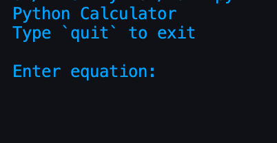
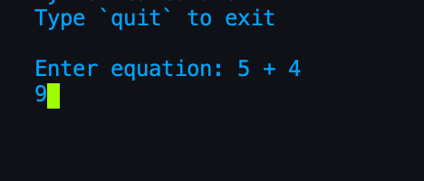
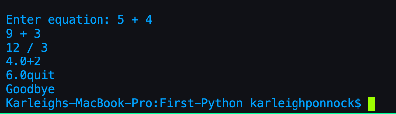

# First-Python
First exercises in Python!

Simple exersizes to learn python basics ending in a calculator application that runs in the command line. 

#Instructions  
-Run the program in terminal  
-Next you will be prompted for an equation  
-Type the first equation  
-Continue with operations as long as you would like  
-Type quit to end application  
