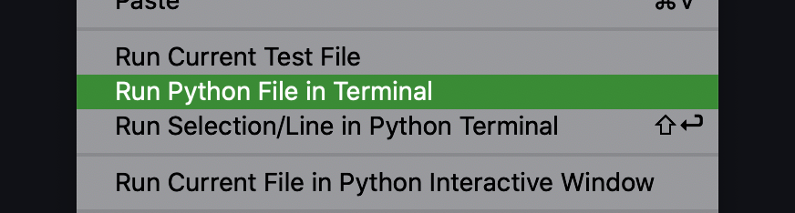

# First-Python
First exercises in Python!

Simple exersizes to learn python basics ending in a calculator application that runs in the command line. 

#Instructions
-Run the program in terminal
-Next you will be prompted for an equation
-Type the first equation
-Continue with operations as long as you would like
-Type quit to end application
